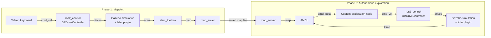

# Penguin 🐧

An autonomous differential-drive robot, simulated end-to-end in ROS 2 + Gazebo, capable of full-floor coverage of a room with obstacles. It builds a map of the room via SLAM, then autonomously explores every reachable corner of that map using AMCL localisation and a **hand-crafted coverage/exploration algorithm** — no off-the-shelf `nav2` planner involved.

[](https://docs.ros.org/en/humble/)
[](https://classic.gazebosim.org/)
[](https://www.python.org/)
[](LICENSE)

## Screenshot

> 🎥 GIF/screenshot of Gazebo + RViz coming soon.

## Overview

Penguin is a differential-drive robot built from scratch using a xacro/URDF description, with a simulated 2D lidar. It is visualised in Gazebo, together with a predefined room containing obstacles, and its motion is controlled using `ros2_control`. The robot runs a full mapping-then-navigation workflow, entirely in simulation, to enable full-floor coverage, as follows:

1. **Build a map** — drive the robot around the room manually with keyboard teleop, while `slam_toolbox` builds an occupancy grid map from lidar scans.
2. **Autonomously explore** — reload the saved occupancy map, localise the robot's pose against it with AMCL, and let a custom greedy coverage algorithm systematically drive the robot to every unvisited, reachable area — built from scratch rather than relying on `nav2`'s built-in planner.

## Architecture



See [`docs/deep-dive.md`](docs/deep-dive.md) for a component-by-component breakdown of *why* each piece of this pipeline works the way it does — `ros2_control`'s hardware abstraction, why the robot needs both an `odom` and `map` frame, how `slam_toolbox` builds the map, etc.

## Key features

- **Custom robot description** (`xacro`) — differential-drive chassis with two driven wheels, two casters, and a simulated 2D lidar, with full visual/collision/inertial properties per link.
- **Gazebo simulation** — simulates the robot and the room in place of real hardware; Gazebo plugins bridge the simulated sensors and actuators into the ROS 2 software stack.
- **`ros2_control`-based robot-motion control** — `DiffDriveController` and `JointStateBroadcaster` running against a `gazebo_ros2_control` hardware interface, controlling the robot's motion and reporting its joint state.
- **SLAM mapping** via `slam_toolbox` to build an occupancy map of the room.
- **AMCL localisation** to localise the robot's position against the saved map for the autonomous phase.
- **A hand-rolled exploration algorithm** (`scripts/`) — reads AMCL's live pose, checks each of the four cardinal directions for obstacles, and prioritises moving toward whichever unvisited, reachable direction is clear, to systematically cover the whole map.

## Tech stack

`ROS 2 Humble` · `Gazebo Classic 11` · `Python (rclpy)` · `xacro`/`URDF` · `slam_toolbox` · `Nav2 (map_server + AMCL)` · `Ceres Solver`

## Getting started

### Prerequisites

- Ubuntu 22.04 (native or WSL2)
- [ROS 2 Humble Desktop](https://docs.ros.org/en/humble/Installation/Ubuntu-Install-Debs.html)

> **Running in WSL2?** If `colcon build` fails with `configure_file: Operation not permitted`, add `options = "metadata"` under `[automount]` in `/etc/wsl.conf`, then run `wsl --shutdown` from Windows and reopen your terminal.

### Installation

```bash
git clone https://github.com/PenguinInTheSky/Penguin.git
cd Penguin

# Dependencies not bundled with ros-desktop
sudo apt install ros-humble-xacro ros-humble-joint-state-publisher-gui \
                  ros-humble-gazebo-ros-pkgs ros-humble-gazebo-ros2-control \
                  ros-humble-ros2-controllers ros-humble-slam-toolbox \
                  ros-humble-nav2-map-server ros-humble-nav2-bringup \
                  ros-humble-teleop-twist-keyboard

colcon build --symlink-install
source install/setup.bash
```

> If RViz/Gazebo renders a black screen (common under WSLg), run `export LIBGL_ALWAYS_SOFTWARE=1` before launching.

## Usage

To watch the robot cover the room, skip straight to [Phase 2](#phase-2--autonomous-exploration).

### View the robot model only using RViz2

```bash
ros2 launch Penguin launch_rviz.launch.py
```

### Phase 1 — build a map

In `config/mapper_params_online_async.yaml`, set `mode: mapping`.

Four terminals (each needs `source install/setup.bash`, `source /opt/ros/humble/setup.bash`, and `export LIBGL_ALWAYS_SOFTWARE=1` if needed):

```bash
# 1. Gazebo + robot visualisation
ros2 launch Penguin launch_gazebo_build_map.launch.py

# 2. SLAM
ros2 launch slam_toolbox online_async_launch.py \
  params_file:=$(ros2 pkg prefix Penguin)/share/Penguin/config/mapper_params_online_async.yaml

# 3. Drive it around: type driving commands in this terminal, following the instructions displayed there
ros2 run teleop_twist_keyboard teleop_twist_keyboard --ros-args -r /cmd_vel:=/diff_cont/cmd_vel_unstamped

# 4. Monitor the progress of the map build live
rviz2 -d install/Penguin/share/Penguin/config/view_map_build.rviz
```

Once you've covered the space, save the map:

```bash
ros2 run nav2_map_server map_saver_cli -f small_room_saved
```

### Phase 2 — autonomous exploration

In `config/mapper_params_online_async.yaml`, set `mode: localization` (this is a literal value the software expects, spelled the American way regardless of the rest of this document).

Two terminals:

```bash
# 1. Gazebo + robot + the exploration node
ros2 launch Penguin launch_gazebo.launch.py

# 2. Localisation against the saved map
ros2 launch nav2_bringup localization_launch.py \
  map:=$(ros2 pkg prefix Penguin)/share/Penguin/maps/small_room/small_room_saved.yaml \
  use_sim_time:=true
```

The robot seeds AMCL's initial pose automatically, then drives itself around the room, prioritising unexplored territory until the whole map is covered.

## Project structure

```
description/     xacro/URDF: chassis, wheels, lidar, ros2_control interfaces
worlds/          Gazebo world files
config/          controller, SLAM, and RViz configs
launch/          launch files for each phase
scripts/         custom exploration algorithm (map parsing, geometry, driver node)
maps/            saved occupancy grid maps
docs/            deep-dive notes on how each subsystem works
```

## License

[Apache 2.0](LICENSE)
