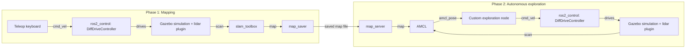

# Penguin 🐧

An autonomous differential-drive robot, simulated end-to-end in ROS 2 + Gazebo: it builds a map of a room via SLAM, then autonomously explores every reachable corner of that map using AMCL localization and a **hand-written coverage/exploration algorithm** — no off-the-shelf `nav2` planner involved.

[](https://docs.ros.org/en/humble/)
[](https://classic.gazebosim.org/)
[](https://www.python.org/)
[](LICENSE)

## Demo

> 🎥 GIF/screenshot of Gazebo + RViz coming soon.

## Overview

Penguin is a from-scratch differential-drive robot (xacro/URDF description, `ros2_control`-based drivetrain, simulated 2D lidar) that runs a full mapping-then-navigation workflow entirely in simulation:

1. **Build a map** — drive the robot around a custom Gazebo world with keyboard teleop while `slam_toolbox` builds an occupancy grid map from lidar scans.
2. **Autonomously explore** — reload that saved map, localize against it with AMCL, and let a custom greedy coverage algorithm systematically drive the robot to every unvisited, reachable cell — computing its own swept-rectangle collision checks against the raw occupancy grid rather than delegating to `nav2`'s planner/controller stack.

## Architecture



See [`docs/deep-dive.md`](docs/deep-dive.md) for a component-by-component breakdown of *why* each piece of this pipeline works the way it does — `ros2_control`'s hardware abstraction, why the robot needs both an `odom` and `map` frame, how `slam_toolbox` builds the map, etc.

## Key features

- **Custom robot description** (`xacro`) — differential-drive chassis with two driven wheels, two casters, and a simulated 2D lidar, with full visual/collision/inertial properties per link.
- **`ros2_control`-based drivetrain** — `DiffDriveController` + `JointStateBroadcaster` running against a `gazebo_ros2_control` hardware interface, the same interface a real hardware driver would implement.
- **SLAM mapping** via `slam_toolbox` (scan matching + pose-graph loop closure).
- **AMCL localization** against the saved map for the autonomous phase.
- **A hand-rolled exploration algorithm** (`scripts/`) — reads AMCL's live pose, checks four cardinal directions against the raw occupancy grid via a custom swept-rectangle point-in-polygon collision test, and prioritizes unvisited, reachable cells to systematically cover the whole map.

## Tech stack

`ROS 2 Humble` · `Gazebo Classic 11` · `Python (rclpy)` · `xacro`/`URDF` · `slam_toolbox` · `Nav2 (map_server + AMCL)` · `Ceres Solver`

## Getting started

### Prerequisites

- Ubuntu 22.04 (native or WSL2)
- [ROS 2 Humble Desktop](https://docs.ros.org/en/humble/Installation/Ubuntu-Install-Debs.html)

> **Running in WSL2?** If `colcon build` fails with `configure_file: Operation not permitted`, see the WSL2 note in [`docs/deep-dive.md`](docs/deep-dive.md#debugging-notes-worth-remembering) — it's a one-line `/etc/wsl.conf` fix.

### Installation

```bash
git clone https://github.com/PenguinInTheSky/Penguin.git
cd Penguin

# Dependencies not bundled with ros-desktop
sudo apt install ros-humble-xacro ros-humble-joint-state-publisher-gui \
                  ros-humble-gazebo-ros-pkgs ros-humble-gazebo-ros2-control \
                  ros-humble-ros2-controllers ros-humble-slam-toolbox \
                  ros-humble-nav2-map-server ros-humble-nav2-bringup \
                  ros-humble-teleop-twist-keyboard

colcon build --symlink-install
source install/setup.bash
```

> If RViz/Gazebo renders a black screen (common under WSLg), run `export LIBGL_ALWAYS_SOFTWARE=1` before launching.

## Usage

### View the robot model only

```bash
ros2 launch Penguin launch_rviz.launch.py
```

### Phase 1 — build a map

Four terminals (each needs `source install/setup.bash`):

```bash
# 1. Gazebo + robot
ros2 launch Penguin launch_gazebo_build_map.launch.py

# 2. SLAM
ros2 launch slam_toolbox online_async_launch.py \
  params_file:=$(ros2 pkg prefix Penguin)/share/Penguin/config/mapper_params_online_async.yaml

# 3. Drive it around
ros2 run teleop_twist_keyboard teleop_twist_keyboard --ros-args -r /cmd_vel:=/diff_cont/cmd_vel_unstamped

# 4. (optional) watch the map build live
rviz2 -d install/Penguin/share/Penguin/config/view.rviz
```

Once you've covered the space, save the map:

```bash
ros2 run nav2_map_server map_saver_cli -f small_room_saved
```

### Phase 2 — autonomous exploration

Two terminals:

```bash
# 1. Gazebo + robot + the exploration node
ros2 launch Penguin launch_gazebo.launch.py

# 2. Localization against the saved map
ros2 launch nav2_bringup localization_launch.py \
  map:=$(ros2 pkg prefix Penguin)/share/Penguin/maps/small_room/small_room_saved.yaml \
  use_sim_time:=true
```

The robot seeds AMCL's initial pose automatically, then drives itself around the room, prioritizing unexplored territory until the whole map is covered.

## Project structure

```
description/     xacro/URDF: chassis, wheels, lidar, ros2_control interfaces
worlds/          Gazebo world files
config/          controller, SLAM, and RViz configs
launch/          launch files for each phase
scripts/         custom exploration algorithm (map parsing, geometry, driver node)
maps/            saved occupancy grid maps
docs/            deep-dive notes on how each subsystem works
```

## Challenges & what I learned

- **WSL2 file permissions.** Building from a Windows-drive path (`/mnt/c/...`) failed with cryptic `Operation not permitted` errors from CMake — traced it to WSL2's `DrvFs` mount faking Unix permissions by default. Fixed at the mount-option level (`metadata` flag in `/etc/wsl.conf`) rather than moving the whole project.
- **Debugging a silent `ros2_control` topic mismatch.** Teleop published to `/cmd_vel`, but the robot didn't move and threw no errors. Used `ros2 topic info --verbose` to spot `DiffDriveController` was actually listening on `diff_cont/cmd_vel_unstamped` — a controller-relative topic, not the bare default.
- **Found and fixed a geometry bug** in the custom collision-check algorithm: a misplaced parenthesis meant one branch of the swept-rectangle point-in-polygon test called a helper function with a missing required argument, crashing obstacle avoidance for a narrow range of robot orientations.

## Future improvements

- Add a proper demo GIF/video.
- Generalize the exploration algorithm beyond a single room layout.
- Add automated tests for the map/geometry utilities in `scripts/`.

## License

[Apache 2.0](LICENSE)
